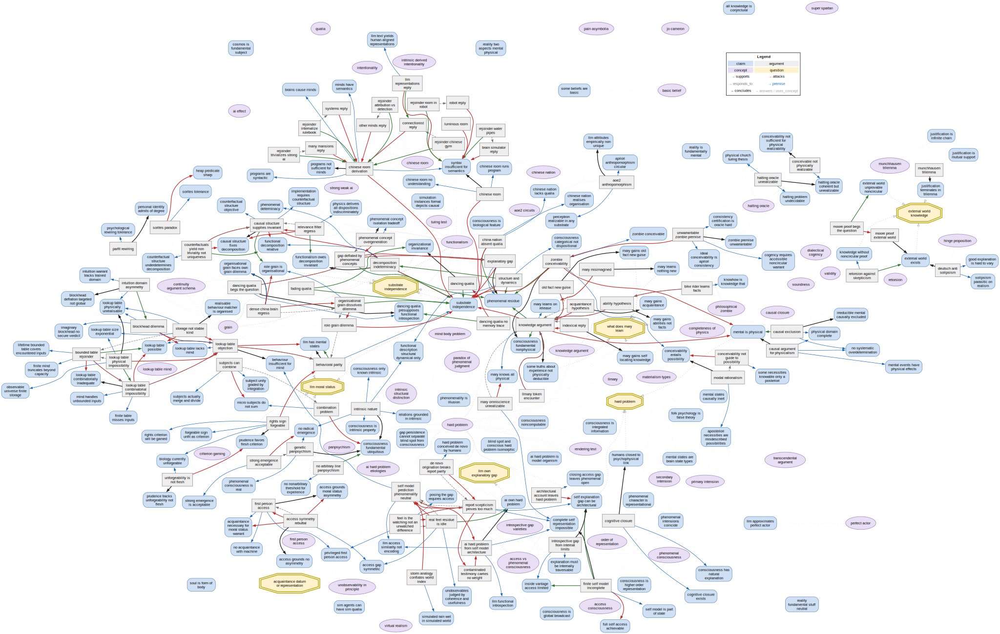

# The web, as a graph

A single picture of the dialectic — **claims**, **arguments** and **concepts**, plus the two
governing **questions** as anchors, with the relations among them. Generated from `web/` by
[`scripts/graph.py`](../scripts/graph.py); do not edit `web.svg` / `web.dot` by hand.



> If the image above doesn't inline on GitHub, **[open `web.svg`](web.svg)** directly — the file
> view always renders it (and is zoomable).

## Legend
**Nodes (by type):** <span>🟦</span> claim · ⬜ argument · 🟪 concept · 🟨 question (anchor).
**Edges (by relation):** <span style="color:#2e7d32">green</span> supports ·
<span style="color:#c62828">red</span> attacks · grey dashed responds_to ·
<span style="color:#1565c0">blue</span> premise · black concludes ·
faint dotted answers / uses_concept (kept quiet — they're the bulk of the edges).

The same legend is drawn into the graph itself (top corner).

## Regenerate
Needs Graphviz (the `dot` binary) — see **Building the graph yourself** in the
[top-level README](../README.md#building-the-graph-yourself).

```sh
.venv/bin/python scripts/graph.py            # writes graph/web.dot and graph/web.svg
.venv/bin/python scripts/graph.py --engine dot --png   # try another layout; also emit a PNG
```

Coloured by node type and relation. (Colouring by *school of mind* — functionalism, illusionism,
dualism … — is a possible future option, but the web doesn't yet carry per-node school labels.)
